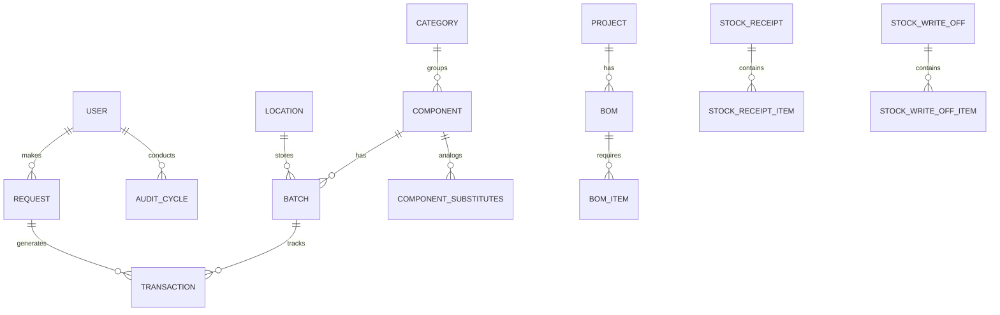

Бронгулеев Даниил Дмитриевич

Студент группы - ИС-43

Сроки прохождения практики - 20.04.2026 по 17.05.2026

Тема преддипломной практики практики - Система аудита и учета склада радиоэлектронных компонентов
прога в ветке мастер 

---

##  Архитектура системы
- **Тип:** Клиент-Сервер (REST API)
- **Безопасность:** Система ролевого доступа на основе JWT-токенов (роли: Manager, WarehouseWorker, Sysadmin, Salesperson, Auditor).

### Frontend
- **Сборщик и Ядро:** Vite 8 + React 19.
- **Роутинг:** React Router DOM v7.
- **Глобальное состояние:** Zustand.
- **Взаимодействие с API:** Axios.
- **Дизайн:** Vanilla CSS.
- **Иконки и Графики:** Векторные иконки из библиотеки Lucide-React и библиотека интерактивных графиков Recharts (для системы отчетов).
- **Печать маркировки:** Интегрирован модуль React-QR-Code для генерации штрихкодов компонентов и ячеек.

### Backend
- **Язык и Фреймворк:** Python 3.14 + FastAPI.
- **Веб-сервер:** Uvicorn.
- **ORM:** SQLAlchemy.
- **Валидация данных:** Pydantic.
- **Аутентификация и криптография:** 
  - Хеширование паролей сделано через Passlib (bcrypt).
  - Авторизация реализована через JWT-токены (python-jose).
- **База данных:** SQLite.

---

##  Возможности программы
- **Управление пользователями:** Создание пользователей, назначение ролей и ограничение доступа к маршрутам.
- **Складской учет (Инвентарь):** Добавление, редактирование категорий и радиокомпонентов. Поддержка аналогов (замен).
- **Документооборот:** 
  - **Поступления (Inbound):** Оформление приходных накладных.
  - **Списания (Write-offs):** Оформление актов списания (брак, использование).
  - **Перемещения (Transfers):** Внутренние перемещения между ячейками и складами.
- **Складская топология:** Управление зонами, рядами, стеллажами и конкретными ячейками (генерация баркодов).
- **Аудит и инвентаризация:** Создание циклов инвентаризации, сканирование по штрихкоду/RFID для сверки ожидаемого и фактического количества.
- **Проектные сборки (BOM - Bill of Materials):** Создание спецификаций к проектам и формирование запросов на выдачу под конкретный проект.
- **Аналитика:** Визуальные графики и дашборды, отображающие остатки, движение товаров.
- **Печать этикеток:** Массовая генерация и вывод на печать QR/Штрих-кодов компонентов.

---

##  Структура проекта
```text
radio_inventory/
├── api/                   # Backend (FastAPI)
│   ├── main.py            # Точка входа в API и роуты
│   ├── models.py          # SQLAlchemy модели базы данных
│   ├── schemas.py         # Pydantic схемы валидации
│   ├── crud.py            # Функции работы с базой данных
│   ├── database.py        # Настройки подключения к БД
│   └── radio_inventory.db # Файл базы данных SQLite
│
├── frontend/              # Frontend (React 19)
│   ├── src/
│   │   ├── components/    # Переиспользуемые UI компоненты
│   │   ├── pages/         # Экраны и страницы приложения
│   │   └── store/         # Zustand глобальные стейты
│   └── package.json       # Зависимости фронтенда
│
├── start_system.bat       # Скрипт быстрого запуска всей системы
└── stop_system.bat        # Скрипт остановки сервисов
```

---

##  Структура базы данных и Модели
Система базируется на реляционной модели. Основные бизнес-сущности:

1. **User (Пользователь)** - хранит данные авторизации и роль.
2. **Component (Компонент)** - справочник радиодеталей (название, парт-номер, производитель).
3. **Category (Категория)** - группировка компонентов.
4. **Location (Локация)** - складская ячейка (зона, ряд, стеллаж).
5. **Batch (Партия)** - конкретная поставка компонента (кол-во, штрихкод, привязка к локации и компоненту).
6. **Transaction (Транзакция)** - лог любого движения партии (IN, OUT, RETURN).
7. **Документы:** `StockReceipt` (Приход), `StockWriteOff` (Списание), `StockTransfer` (Перемещение). Каждый документ имеет свои табличные части (`Items`).
8. **Project & BOM** - проекты и их спецификации материалов (Bill of Materials).
9. **AuditCycle & AuditResult** - циклы проведения инвентаризации и результаты сканирования ячеек.

### ER-диаграмма(упрощенная)


---

##  Краткий справочник API (Маршруты)

### Авторизация и Пользователи
- `POST /login/` — Авторизация и получение данных.
- `GET /users/`, `POST /users/` — Управление пользователями.
- `PUT /users/{user_id}/role` — Изменение роли.

### Справочники
- `GET/POST /categories/` — Управление категориями.
- `GET/POST /components/` — Управление номенклатурой радиодеталей.
- `GET /components/stock` — Получение списка компонентов с их текущими остатками.
- `GET/POST /locations/` — Управление складами и ячейками.

### Складской учет (Документы)
- `GET/POST /batches/` — Управление партиями компонентов (привязка к QR/RFID).
- `GET /batches/barcode/{barcode}` — Поиск партии по штрихкоду.
- `GET/POST /receipts/` — Приходные накладные.
- `POST /receipts/{id}/post` — Проведение прихода (зачисление на остатки).
- `GET/POST /write-offs/` — Акты списания.
- `GET/POST /transfers/` — Акты перемещения.
- `GET/POST /transactions/` — Просмотр истории движений.

### Проекты и Запросы (BOM)
- `POST /projects/`, `POST /boms/` — Создание проектов и спецификаций.
- `GET/POST /requests/` — Создание и просмотр заявок на выдачу под проект.
- `POST /requests/{id}/fulfill` — Подтверждение/выдача компонентов по заявке.

### Аудит
- `GET/POST /audits/` — Управление циклами инвентаризации.
- `POST /audits/{id}/scan` — Внесение фактических данных по отсканированной ячейке/партии.

---

##  Запуск и остановка системы

Для удобства развертывания проекта в корне предусмотрены скрипты:

- **Запуск всей системы (Frontend + Backend):** 
  Откройте терминал в корневой папке проекта и выполните `start_system.bat`
- **Остановка серверов:** 
  Выполните `stop_system.bat`

*Бэкенд по умолчанию запускается на порту `8000`, а фронтенд на порту по умолчанию Vite (обычно `5173`).*

---

## Скриншоты приложения


